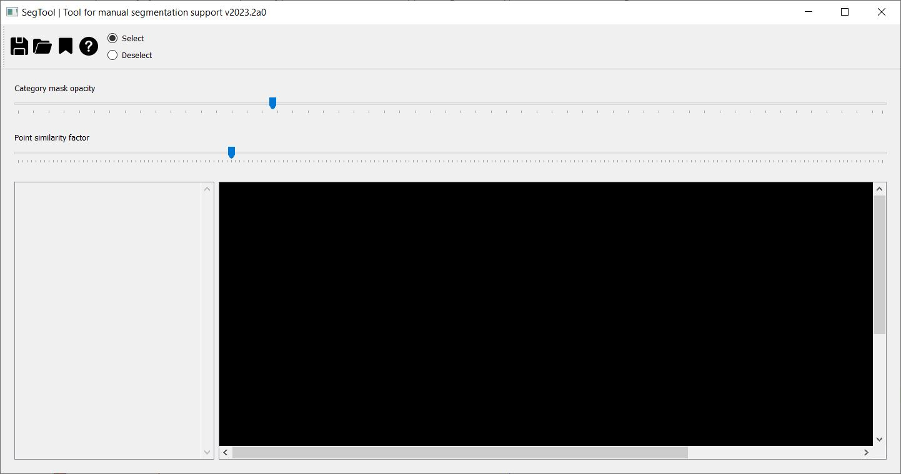
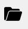
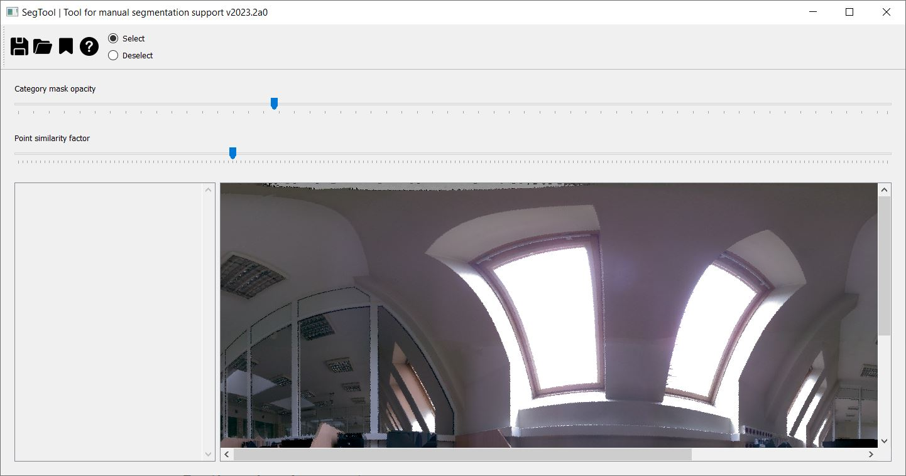
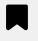
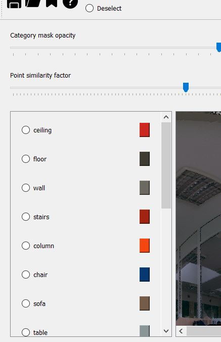
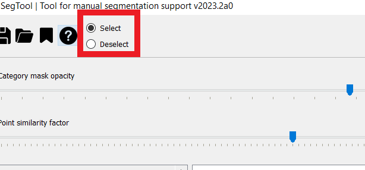
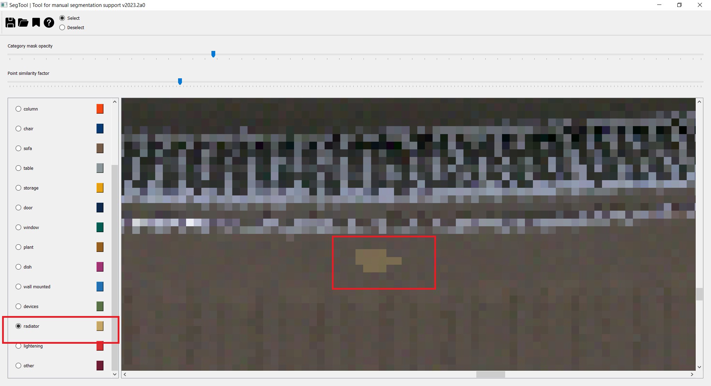
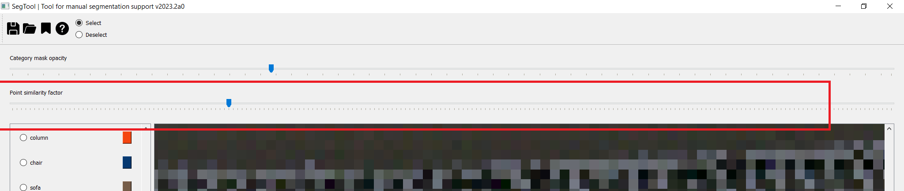
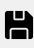

# SP-SEG: Proof of concept tool for manual segmentation by spheripixel projection
In this repository, you can find a proof of concept of the tool for manual point cloud labeling by spherical point-pixel projection.

## ❗ Limitations
The current version is just the proof of concept version.

## 🔧 Environment and installation
```python
python >= 3.10
```
Required packages:
```python
"numpy>=1.23.0",
"pillow>=9.3.0",
"pydantic>=1.10.0",
"PyQt5>=5.15.0",
"scikit-learn>=1.2.0",
"scipy>=1.9.0",
"colormath",
"tqdm"
```

To install the software, run:
```bash
pip install segtool
```

Then, you can run the software with the command:
```bash
D:\>segtool
```


## 📖 Instruction
The main view of the software looks like the following:

1. [Opening point cloud](#opening-a-point-cloud)
2. [Loading labels definition](#loading-labels-definition)
3. [Zooming in and out](#zooming-in-and-out)
4. [Vertical roll](#vertical-roll)
5. [Horizontal roll](#horizontal-roll)
6. [Object segentation](#object-segmentation)
7. [Deselecting region](#deselecting-region)
8. [Changing mask opacity](#changing-mask-opacity)
9. [Accepting an object](#accepting-an-object)
10. [Saving segmentation result](#saving-segmentation-result)


### Opening a point cloud


### Loading labels definition


### Zooming in and out


### Vertical roll


### Horizontal roll

### Object segmentation

### Deselecting region

### Changing mask opacity


### Accepting an object


### Saving segmentation result




### 1. Opening a point cloud
To open a point cloud, choose the opening icon 
and point the proper file (**currently only PTS files are with columns (x, y, z, intensity, R, G, B) are supported**).

Loading the point cloud might take several minutes. At this time, the point cloud is converted to the spheripixel projection, and CIELab colors are computed based on RGB. You can track the process of preprocessing in the command line:

```bash
 2%|▉                                         | 23831/1036800 [00:03<02:23, 7067.40it/s]
```

As soon as the preprocessing finishes, you will see the spheripixel projection in the main window (see below)




### 2. Loading labels definition
To load predefined labels definition, choose the icon  and load the JSON file with labels definitions.
The labels definition file should have the following schema:

```json
[
  {
    "label": "class_name_1",
    "code": 1,
    "color": [255, 0, 0]
  },
  {
    "label": "class_name_2",
    "code": 2,
    "color": [0, 0, 255]
  }
]
```
**REMEMBER**: 
1. `"code"` needs to be an integer
2. `"color"` needs to be a 3-element list of integers
3. `"label"` should be unique in the JSON file

When labels are loaded, you will see them in the menu on the right-hand side:



Here, you can select objects of which category you are about to segment right now. 
Note that next to the label name, you can see the associated color.

Now, we are ready to start the segmentation. 
Let's select the category and go on!

### 3. Manipulating the view
Having loaded the point cloud and the labels, let's preview our scene. 

- To zoom in or zoom out the scene, use the `Left CTRL` button and mouse wheel.

- To scroll vertically, use the mouse wheel,

- To scroll the view horizontally, use the `Left SHIFT` button and mouse wheel.

It may turn out that some objects are located on the edges, to enable proper selection also of those points, you can "look around" the scene:

- To look around horizontally, use the `W` key.

- To look around vertically, use the `Q` key.

### 4. Manual segmentation

When we already know how to manipulate the view, let's move to manual segmentation.

The software might work in two modes:
1. selection
2. deselection

The first one lets you select points belonging to an object of the chosen category.
The other one, in turn, lets you deselect points, if you selected them by mistake.

If so, ensure the `Select` radio button is chosen (see below):



In the software, there are three ways of manipulating (selecting/deselecting) points:
1. point-wise,
2. semi-supervised similarity-driven,
3. rectangular.

#### 3.1 Point-wise
To use point-wise selection (deselection) just use the left mouse button to click on the pixel belonging to the currently chosen category.
Let's zoom in and select several points of the `radiator` category.



#### 3.2 Semi-supervised similarity-driven
When you selected a point with the left mouse button, it becomes **a seed** for the region-growing procedure.
Region growing is performed based on the color similarity in the CIELab color space:

$$S:\Delta E < \epsilon,$$
where $\epsilon$ is a similarity threshold selected with the slider `Point similarity threshold` (see below):



Now, to increase the region, use the `+` key. If you want to decrease the region by one level --- use the `-` key.

#### 3.3 Rectangular
To select a rectangular region, choose a pixel with the left mouse button and hold the `Left ALT` key. Then, choose the other pixel on the diagonal and release the `Left ALT` key. You will see the rectangular region was selected based on the similarity threshold. You can manipulate the slider with a point similarity threshold to see how points inside the selected region are considered or rejected.


If you are sure all the necessary points are selected, press the `F1` key to confirm the segmentation of a single instance of the chosen category.
You will see a dialog window with the information.


### 5. Saving the results
To save the results, use the icon  to set the name of the resulting PTS file.
The result is selected as a PTS point cloud with extra two last columns:
1. with the category ID (as used in the label's definition JSON file),
2. the number of an object within the category.

## 🏎️ Further development
- [ ] code optimization
- [ ] code cleaning
- [ ] add handling other point cloud formats
- [ ] handle non-single-setup point clouds
- [ ] enable saving draft segmentation result


## 📝 Citation

```bibtex
@ONLINE{sp-seg,
  author = {Walczak, J., Osuch, A., Wojciechowski, A.},
  title = {{SP-SEG}: Proof of concept tool for manual segmentation by spheripixel projection},
  year = 2023,
  url = {https://github.com/jamesWalczak/sp-seg-tool},
  urldate = {<access date here>}
}
```

## ⚖️ 3rd party attribution
<b>Icons attribution:</b> <a href='https://www.flaticon.com/free-icons/save' title='save icons'>Save icons created by Freepik - Flaticon</a>
<br/>
<b>Animation attribution:</b> Animation generated from <a href='https://icons8.com'>Icons8</a>

## 🎁 Ackowledgement
This software was developed as a part of the research project "Semantic analysis of 3D point clouds", co-funded by the Polish National Center for Research and Development under the LIDER XI program [grant number 0092/L-11/2019]. 